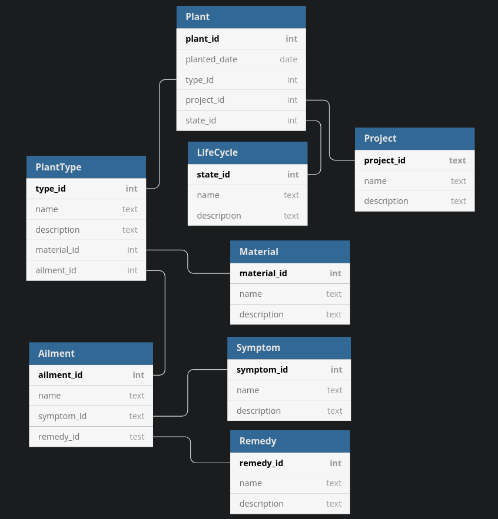

# kga-database

## Create and Test Database

Instructions to create and test the database are located in `kga-database/scripts/README.md`.

## Relational Notation

Symptom(__symptom_id__, name, description)

Remedy(__remedy_id__, name, description)

Ailment(__ailment_id__, name, *remedy_id*, *symptom_id*)

Material(__material_id__, name, description)

PlantType(__type_id__, name, description, *ailment_id*, *material_id*)

Project(__project_id__, name, description)

LifeCycle(__state_id__, name, description)

Plant(__plant_id__, planted_date, *project_id*, *type_id*, *state_id*)

## Functional Dependencies

{ plant_id } -> { planted_date, project_id, type_id, state_id }

{ project_id } -> { project_name, project_description }

{ type_id } -> { type_name, type_description, ailment_id, material_id }

{ ailment_id } -> { ailment_name, symptom_id, remedy_id }

{ symptom_id } -> { symptom_name, symptom_description }

{ remedy_id } -> { remedy_name, remedy_description }

{ material_id } -> { material_name, material_description }

{ state_id } -> { state_name, state_description }

## Entity Relationship Diagram

## Narrative

The original designs given to us by the entrepreneur do not fit very well for a database in a mobile app. These designs
show multiple databases separated into different topics and chapters, much like a book. This book layout would not be
useful for an app because it restricts the information too much. Users like to navigate to whatever information they
currently need, not read everything in order like chapters in a book.

Instead, the new design that we are proposing is for one database that is separated into several tables, like a Plants
table, an ailments table, and a materials table. These tables would be connected together, allowing users to search for
the specific information that they want. For example, if a user wanted to just look at ailments for a specific plant
like a rose, they could search for rose ailments without having to look through materials. This allows each individual
user to use the app how they want, searching for what they need at that moment.

We feel that our proposed solution would work better than the initial designs because it is a more appropriate structure
for a mobile app. This would be more along the lines of what users would be used to from other apps instead of the book
format that was proposed. The tables design would be better because there is not much point in implementing a database
for an app if it will just be structured like a book. The entrepreneur should consider making the app with our plans for
the database instead, as it fits the strengths of a database.